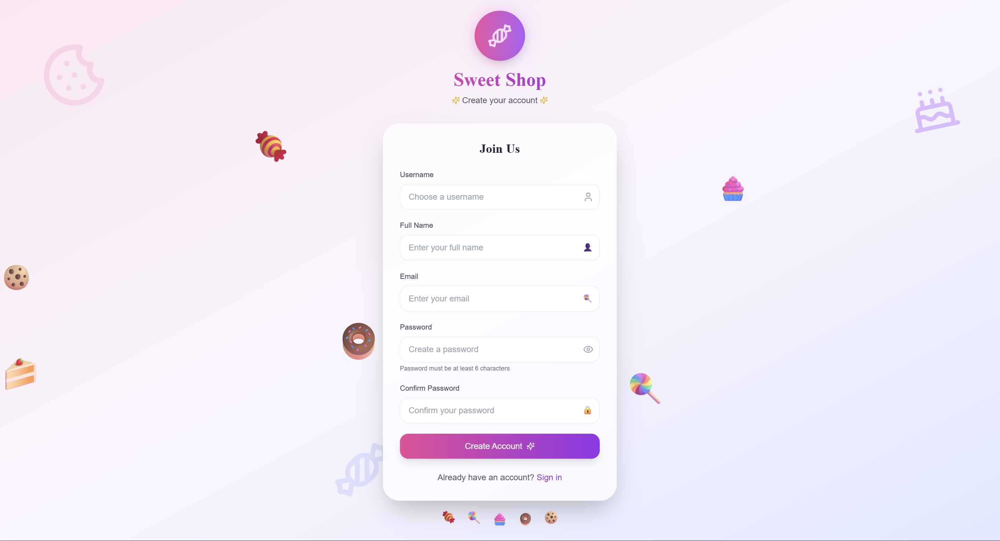
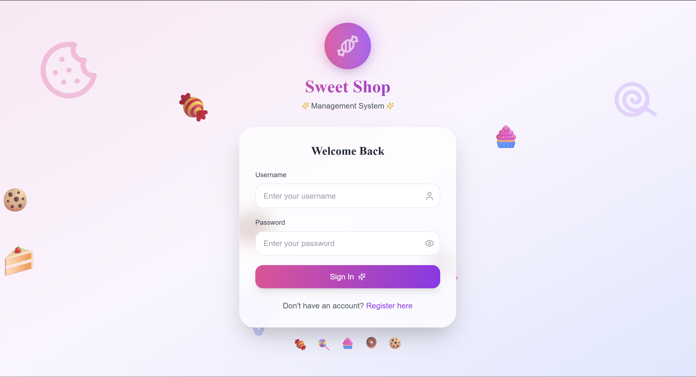
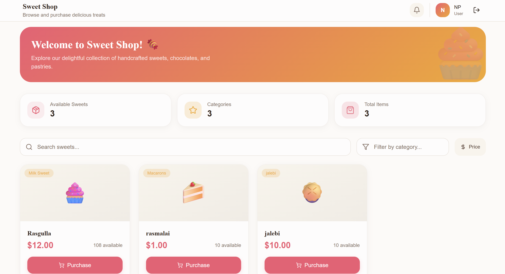
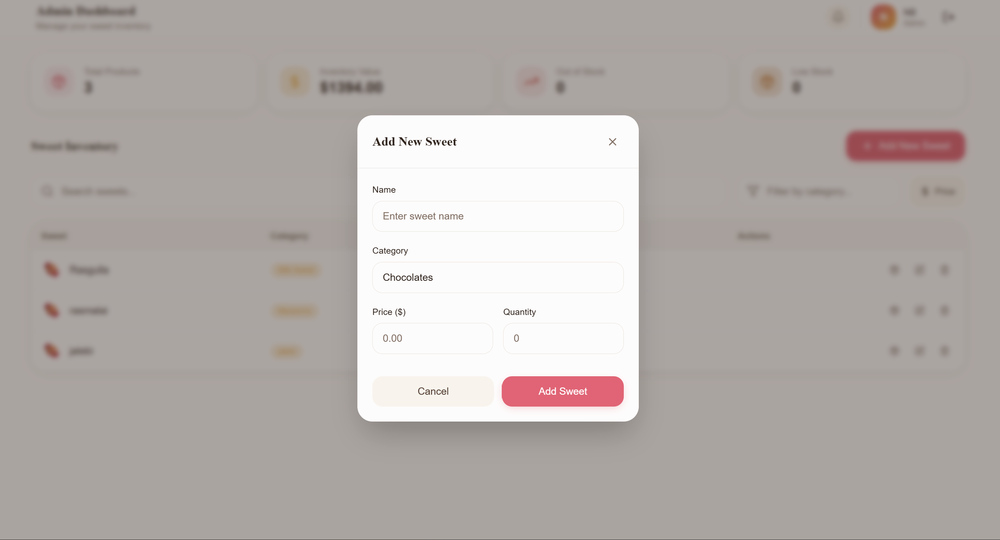
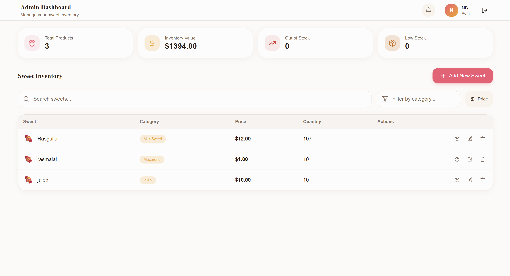

# 🍬 SweetsShopManagement

A **full‑stack Sweet Shop Management System** built as part of a **TDD Kata assessment**. This project demonstrates **Test‑Driven Development (TDD)**, **clean architecture**, **secure authentication**, and a **modern React frontend**.

The application allows users to browse, search, and purchase sweets, while **admin users** can manage inventory (add, update, delete, restock sweets).

---

## 📌 Tech Stack

### Backend

* **Framework:** FastAPI (Python)
* **Database:** SQLite (persistent database)
* **ORM:** SQLAlchemy
* **Migrations:** Alembic
* **Authentication:** JWT (JSON Web Tokens)
* **Testing:** Pytest
* **Architecture:** Clean Architecture with Repository Pattern

### Frontend

* **Framework:** React
* **UI Generation:** Lovable.ai (initial UI scaffolding)
* **State Management:** React Hooks
* **API Communication:** Axios
* **Styling:** CSS / modern UI components

---

## ✨ Features

### 👤 Authentication

* User registration
* User login
* JWT‑based authentication
* Role‑based access control (User / Admin)

### 🍭 Sweets Management (Protected)

* Add new sweets (**Admin only**)
* View all sweets
* Search sweets by:

  * Name
  * Category
  * Price range
* Update sweet details (**Admin only**)
* Delete sweets (**Admin only**)

### 📦 Inventory Management

* Purchase sweets (quantity decreases automatically)
* Restock sweets (**Admin only**)
* Purchase button disabled when stock is zero

---

## 🚀 Getting Started

### 1️⃣ Clone the Repository

```bash
git clone https://github.com/Nibedan7/SweetsShopManagement.git
cd SweetsShopManagement
```

---

## ⚙️ Backend Setup (FastAPI)

### Create Virtual Environment

```bash
cd SweetsShopAPI
python -m venv venv
source venv/bin/activate   # Linux / Mac
venv\Scripts\activate      # Windows
```

### Install Dependencies

```bash
pip install -r requirements.txt
```

### Run Database Migrations

```bash
alembic upgrade head
```

### Start Backend Server

```bash
uvicorn app.main:app --reload
```

📍 Backend URL:

```
http://127.0.0.1:8000
```

📘 Swagger API Docs:

```
http://127.0.0.1:8000/docs
```

---

## 🧪 Running Tests (TDD)

```bash
pytest -v
```

✔️ Test coverage includes:

* Authentication & authorization
* Sweets CRUD operations
* Inventory purchase & restock logic
* Role‑based access rules

---

## 🎨 Frontend Setup (React)

```bash
cd frontend
npm install
npm start
```

📍 Frontend URL:

```
http://localhost:8080
```

---

## 🔐 API Endpoints Overview

### Auth

* `POST /api/auth/register`
* `POST /api/auth/login`

### Sweets (Protected)

* `POST /api/sweets`
* `GET /api/sweets`
* `GET /api/sweets/search`
* `PUT /api/sweets/{id}`
* `DELETE /api/sweets/{id}` (**Admin only**)

### Inventory

* `POST /api/sweets/{id}/purchase`
* `POST /api/sweets/{id}/restock` (**Admin only**)

---

## 📸 Application Screenshots

> 📌 **Note:** Place screenshots inside a `screenshots/` folder in the root directory and reference them below.

### 🔐 Register Page



### 🔐 Login Page



### 🍭 Sweets Listing



### 🛒 Add Sweet



### 🛠️ Admin Dashboard



---

## 🧠 Test‑Driven Development (TDD)

This project strictly follows the **Red → Green → Refactor** cycle:

1. Write failing tests first
2. Implement minimum logic to pass tests
3. Refactor for clean, maintainable code

Git commit history clearly reflects this workflow.

---

## 🤖 My AI Usage (Mandatory Section)

### AI Tools Used

* **ChatGPT** – backend logic, testing, debugging
* **GLM 4.6** – alternative reasoning & validation
* **Lovable.ai** – frontend UI scaffolding

### How I Used AI

* Generated initial project structure ideas
* Assisted in writing unit tests for FastAPI services
* Debugged SQLAlchemy, Alembic, and JWT issues
* Helped refine repository pattern and API design
* Generated frontend UI layouts using Lovable.ai
* Improved README documentation clarity

### Reflection

AI significantly improved development speed by reducing boilerplate work and accelerating debugging. All **business logic**, **architecture decisions**, and **final implementations** were reviewed, modified, and validated by me to ensure correctness, learning value, and originality.

---

## 📄 License

This project is licensed under the **MIT License**.

---

## 🙌 Acknowledgements

* FastAPI & React documentation
* Pytest community
* Open‑source contributors
* AI tools that enhanced development productivity

---

## 📬 Contact

**Nibedan Pattanaik**
📧 Email: [nibedanpattanaik6@gmail.com](mailto:nibedanpattanaik6@gmail.com)
🔗 LinkedIn: [https://linkedin.com/in/nibedan-pattanaik7](https://linkedin.com/in/nibedan-pattanaik7)
